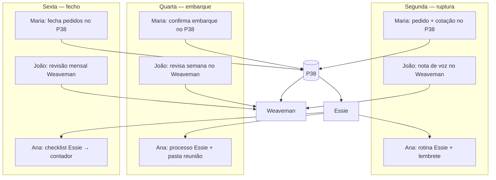

# Caso de uso — P38, Weaveman e Essie em conjunto

**Documento:** exemplo narrativo de uso das três plataformas  
**Personas:** gestor (dono), comprador, secretária executiva  
**Cenário:** uma semana típica numa empresa de varejo/atacado  
**Data:** agosto de 2026

---

## 1. As três plataformas (resumo)

| Plataforma | Função | Quem alimenta | Quem consome |
|------------|--------|---------------|--------------|
| **P38** | Operação do negócio — vendas, compras, estoque, financeiro | Equipa operacional | Toda a equipa conforme perfil |
| **Weaveman** | Visão do empresário — observar, narrar, rever no tempo | Dono / gestor (voz, notas) | Dono / gestor (cofre pessoal) |
| **Essie** | Eficiência na gestão — automação, previsibilidade, clareza nos processos | Processos + dados do P38 | Gestores, compradores, secretária, executivos |

**Regra de ouro:** o P38 é a verdade operacional; o Weaveman é a camada pessoal do dono; a Essie liga processos e reduz retrabalho para quem gere e executa rotinas.

---

## 2. Personas do exemplo

| Nome | Função | Perfil |
|------|--------|--------|
| **João** | Gestor / sócio (dono) | Observa o negócio, decide margem e caixa, não opera o ERP no dia a dia |
| **Maria** | Compradora | Cotações, pedidos de compra, embarques, fornecedores |
| **Ana** | Secretária executiva | Agenda do gestor, reuniões, follow-up, apoio administrativo |

**Empresa fictícia:** Distribuidora de alimentos e bebidas, com loja própria e atacado.

---

## 3. O evento da semana

Na **segunda-feira**, Maria identifica ruptura de estoque numa linha de refrigerantes importados. Abre cotação com dois fornecedores. Na **quarta**, o fornecedor Silva confirma embarque para a semana seguinte, com pagamento de 40% de adiantamento. Na **sexta**, João tem reunião com o contador sobre o mês e precisa decidir se aprova o adiantamento. Ana coordena agenda e documentos.

Este caso mostra como as três plataformas se complementam **sem duplicar trabalho**.

---

## 4. Linha do tempo — quem usa o quê

### Segunda-feira — ruptura e cotação

#### Maria (compradora) → **P38**

1. Abre o módulo **Supply** no P38.
2. Vê alerta de estoque baixo (já calculado pelo sistema).
3. Cria **pedido de compra** com itens em ruptura.
4. Regista **cotações** dos fornecedores Silva e Costa.
5. Envia pedido para aprovação financeira (status: *Aguardando aprovação*).

**O que o P38 guarda:** pedido, itens, valores, prazos, histórico de cotação.

#### João (gestor) → **Weaveman**

1. De manhã, no carro, grava nota de voz no Weaveman:  
   *"Refrigerante importado sumiu rápido no fim de semana. Pergunta ao Silva se dá pra antecipar se pagarmos adiantado."*
2. A nota fica datada (segunda, 08h42). **Ninguém da equipa vê** — é cofre do dono.

**O que o Weaveman guarda:** áudio transcrito, data/hora, sem obrigar estrutura na hora.

#### Ana (secretária) → **Essie**

1. A Essie mostra rotina da manhã: reuniões da semana, contas a vencer, pedidos críticos.
2. Vê no fluxo de processos: *"Pedido de compra #1847 — aguardando aprovação (Maria)"*.
3. Prepara lembrete para João: *"Compras pediu análise de adiantamento até quarta"*.

**O que a Essie faz:** lê o P38, organiza o que importa, antecipa follow-up — **não substitui** o lançamento da Maria.

---

### Terça-feira — negociação

#### Maria → **P38**

1. Atualiza cotação do Silva com prazo menor e condição de 40% adiantado.
2. Regista observação no pedido: *"Fornecedor aceita antecipar 5 dias com adiantamento."*
3. Mantém status *Aguardando aprovação*.

#### João → **Weaveman**

1. Revisa nota de segunda à noite.
2. Grava segunda nota:  
   *"Se o adiantamento for até R$ 12 mil, ok. Acima disso, falar comigo antes."*
3. **Não abre o P38** — a regra de negócio ficou registada na linguagem dele.

#### Ana → **Essie**

1. Essie dispara rotina automática: *"Pedido #1847 parado há 24h em aprovação"*.
2. Ana agenda slot de 15 min na quinta entre João e Maria (sugestão da Essie com base na agenda).
3. Prepara pauta da reunião a partir dos dados do P38 (valores, prazos, fornecedor).

---

### Quarta-feira — confirmação de embarque

#### Maria → **P38**

1. Fornecedor Silva confirma embarque.
2. Maria regista **data prevista de embarque** e **data prevista de chegada**.
3. Anexa confirmação (e-mail/PDF) ao pedido.
4. Solicita ao financeiro lançamento do adiantamento (fluxo interno do P38).

#### João → **Weaveman**

1. Consulta **linha do tempo da semana** no Weaveman:
   - Segunda: nota sobre refrigerante e adiantamento
   - Terça: teto de R$ 12 mil
2. Vê também **resumo vindo do P38** (só leitura): *"Embarque Silva confirmado — chegada prevista dia 22"*.
3. Decide: está alinhado com o que pensou; não precisa ligar para Maria.

#### Ana → **Essie**

1. Essie executa processo *"Confirmação de embarque"*:
   - Verifica se data, valor e fornecedor estão completos no P38
   - Se falta algo, alerta Maria (não Ana)
2. Ana recebe tarefa: *"Incluir confirmação de embarque na pasta da reunião de sexta com contador"* — documento já sugerido pela Essie a partir do anexo do pedido.

---

### Quinta-feira — alinhamento rápido

#### Maria + João (15 min) — apoio da **Essie**

- Essie montou pauta com 3 pontos (dados do P38 + tarefas pendentes).
- Maria mostra no P38 o pedido #1847 na tela (módulo Supply).
- João **não navega módulos** — olhou o resumo no Weaveman antes e só valida: *"Aprovado dentro do teto."*

#### João → **Weaveman** (após a reunião)

1. Grava: *"Aprovado adiantamento Silva — R$ 11.400. Conferir margem quando chegar."*
2. Marca nota como **"ligar ao pedido #1847"** (estruturação leve — ainda no Weaveman).

#### Maria → **P38**

1. Regista aprovação do gestor no pedido (campo de aprovação / histórico).
2. Financeiro lança adiantamento (módulo Financeiro operacional).

---

### Sexta-feira — fecho do mês e reunião com contador

#### Ana → **Essie** + **P38**

1. Essie roda checklist *"Fechamento mensal — preparação"*:
   - Pedidos em aberto
   - Adiantamentos do mês
   - Contas a pagar na semana seguinte
2. Ana envia ao contador pacote sugerido (relatórios do P38 + anexos organizados pela Essie).
3. Confirma reunião das 15h com pauta já montada.

#### João → **Weaveman**

1. Abre **revisão do mês** no Weaveman:
   - Notas de voz de segunda a sexta
   - Resumo do que o P38 já estruturou (vendas, compras, adiantamentos)
2. Na nota de quinta (*"conferir margem quando chegar"*), o sistema sugere:  
   *"Queres criar lembrete para o dia 22?"* — João confirma.
3. **Não lança** nada no financeiro — só revisa e deixa rasto das decisões.

#### Maria → **P38**

1. Fecha pedidos da semana.
2. Atualiza status logístico dos embarques pendentes.
3. Essie alerta: *"2 pedidos sem data de chegada — completar até segunda"*.

---

## 5. Tabela resumo — uma semana, três pessoas, três plataformas

| Momento | Maria (compradora) | João (gestor) | Ana (secretária) |
|---------|-------------------|---------------|------------------|
| **P38** | Cotação, pedido, embarque, aprovação | Só valida na reunião (se necessário) | Não opera lançamentos |
| **Weaveman** | Não usa | Voz, notas, linha do tempo, revisão mensal | Não usa (cofre do dono) |
| **Essie** | Alertas de processo, checklist embarque | Resumo opcional se autorizar | Rotinas, pautas, follow-up, fecho mensal |

---

## 6. O que cada plataforma fez neste caso (sem sobrepor)

### P38 — verdade operacional

- Pedido #1847, cotações, embarque, adiantamento, histórico
- Fonte para relatórios e para a reunião com o contador
- Alimentado pela **Maria** e pelo **financeiro**

### Weaveman — narrativa e decisão do dono

- 3 notas de voz com regras de negócio (*antecipar*, *teto R$ 12 mil*, *conferir margem*)
- Linha do tempo: semana e mês na linguagem do João
- Ligação opcional nota ↔ pedido, **sem expor** notas à equipa

### Essie — processo, automação e clareza

- Alertas: pedido parado, embarque incompleto, fecho mensal
- Pautas de reunião montadas a partir do P38
- Checklists e rotinas para Ana e Maria
- Previsibilidade: *"na quarta falta aprovação"*, *"na sexta pacote para contador"*

---

## 7. Diagrama do fluxo

---

## 8. Perguntas que cada um deixa de fazer

| Sem o ecossistema | Com P38 + Weaveman + Essie |
|-------------------|----------------------------|
| João: *"O que a Maria pediu mesmo?"* | Viu resumo no Weaveman + notas dele |
| Maria: *"O dono aprovou ou não?"* | Status e histórico no P38; Essie avisou quando parou |
| Ana: *"O que põe na pauta de sexta?"* | Essie montou a partir do P38 |
| João: *"O que eu disse sobre o Silva?"* | Linha do tempo no Weaveman, por data |
| Equipa: *"Por que pagamos adiantado?"* | Histórico no P38; contexto íntimo só no Weaveman se João partilhar |

---

## 9. Limites importantes (confiança e privacidade)

1. **Notas do João no Weaveman** — Maria e Ana **não veem** por defeito.
2. **Essie** — Ana vê processos e tarefas; **não** o cofre de voz do dono.
3. **Aprovação financeira** — registo oficial no **P38**; Weaveman guarda a *intenção* do dono até alguém estruturar.
4. **Automação Essie** — repetitivo e previsível; decisões de valor ficam com pessoa (João, Maria ou financeiro).

---

## 10. Frases de posicionamento

- **P38:** *Um negócio, uma base — a equipa opera com dados estruturados.*
- **Weaveman:** *A história do teu negócio, no teu tempo — fala, revê, decide.*
- **Essie:** *Automação, previsibilidade e clareza nos processos.*

---

*Exemplo para validação de produto. Ajustar nomes de módulos P38 conforme rollout (Supply, Financeiro operacional, etc.).*
