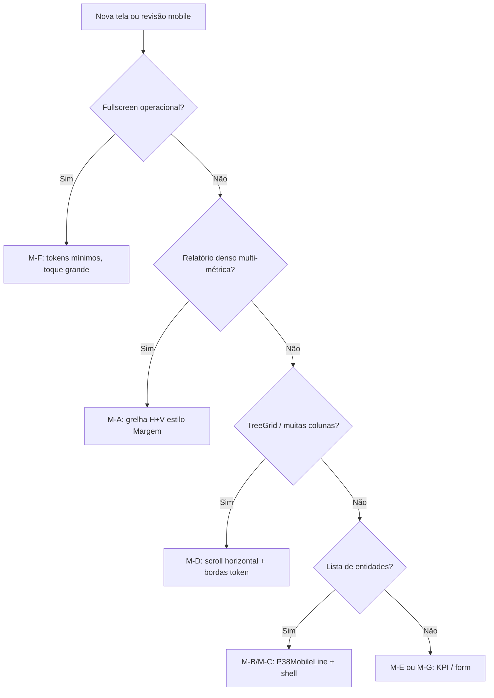

# Plano mobile — paleta P38 mediterrânea e linhas finas (referência Margem)

Objetivo: em **smartphone** (&lt;768px), cada ecrã com listas ou tabelas deve usar a mesma linguagem do **Relatório de Margem mobile** — fundo quente/cinza, **linhas horizontais e verticais finas** (cinza claro no claro, branco ~10% no escuro), tipografia **DIN 1451**, **verde oliva/limão só em dados e ênfase**, não decoração em massa.

Documento irmão: [`p38-desktop-rollout.md`](p38-desktop-rollout.md) (tablet/desktop).

---

## 1. Referência visual — o que copiar do Margem mobile

| Elemento | Implementação atual | Token / classe |
|----------|---------------------|----------------|
| **Fundo da página** | Área rolável | `bg-background` |
| **Contentor da lista** | Borda exterior + cantos | `rounded-lg border border-border/40 dark:border-white/10` |
| **Linha horizontal** (entre registos) | Fina, neutra | `border-b border-border/50 dark:border-white/10` |
| **Linha vertical** (colunas, ex. Qtd \| valores) | Separador de grelha | `border-r border-border/40 dark:border-white/10` |
| **Cabeçalho de colunas** | Painel escuro + labels | `p38Table.panel` + `MARGIN_TABLE_BORDER` |
| **Barra verde lateral** (só resumo/KPI) | 3px oliva/limão | `p38-panel__accent-bar` / `p38Table.panelAccentBar` |
| **Lucro / markup** | Texto acento | `p38-text-accent` / `p38Table.cellAccent` |
| **Scroll sob bottom nav** | Padding inferior | `pb-[var(--p38-scroll-pad-below-nav)]` (`index.css`) |
| **Busca / filtro** | Campo sem borda pesada | `.p38-search-field` |

Ficheiros de referência:

- `src/pages/RelatorioMargem.jsx` — `MargemLinhaMobile`, `MargemMobileColumnHeader`, grelha Qtd/Un + valores tabulados
- `src/lib/p38TableSurfaces.js` — `mobileLine`, `mobileListShell`, `lineListShell`
- `src/components/ui/p38-mobile-line.jsx` — `P38MobileLine`, `P38MobileLineList`
- `src/styles/p38-identity.css` — `.p38-line`, `.p38-list-shell`, variáveis `--p38-divider`

### Dois “modos” de linhas no mobile

| Modo | Quando | Horizontal | Vertical | Componente |
|------|--------|------------|----------|------------|
| **Lista** | CRUD, filas, aprovações, entregas | Sim (`border-b`) | Opcional (`border-l-2` semântico) | `P38MobileLine` + `P38MobileLineList` |
| **Grelha** | Relatórios densos, várias métricas por linha | Sim | Sim (colunas fixas) | Padrão Margem ou extrair `P38MobileGridRow` (futuro) |

Regra: **não misturar** cards com sombra pesada e lista Margem na mesma vista — escolher um modo por ecrã.

---

## 2. Paleta mediterrânea (mobile)

| Papel | Claro | Escuro | Uso no mobile |
|-------|-------|--------|----------------|
| Fundo | `--p38-bg` (warm grey) | `#1f1d22` área | Página, lista |
| Superfície / painel | branco / `card` | `#2d333b` | Header de colunas, KPI strip |
| Divisor | preto 6% | branco 6–10% | `border-border/50`, `dark:border-white/10` |
| Acento dados | oliva `#4A5D23` | limão `#a4ce33` | Lucro, status ok, barra resumo |
| Texto | `foreground` | `foreground` | Títulos DIN uppercase |
| Meta | `muted-foreground` | idem | Subtítulo, UN, datas |

**Verde (regra igual ao desktop):** KPI, lucro, status positivo, ponto ●, barra fina no item ativo da bottom nav — **não** em todos os ícones do Home nem em cada linha de menu.

---

## 3. Padrões de abordagem (mobile)

| Código | Nome | Quando usar | Linhas |
|--------|------|-------------|--------|
| **M-A** | Grelha Margem | Relatórios com ≥3 métricas por linha | H + V |
| **M-B** | Lista P38 | Listas operacionais (pedidos, contas, conferências) | H (+ `border-l` status) |
| **M-C** | Lista + métricas | 1–2 valores à direita (valor, status) | H |
| **M-D** | Tabela / TreeGrid scroll | Produtos, catálogo, vendas gestão | H+V no grid; não forçar `P38MobileLine` |
| **M-E** | KPI / painéis | Home, dashboards, resumo gerente | Sem grelha densa; cards `p38-panel` opcional |
| **M-F** | Fullscreen operacional | PDV, caixa, auto-atendimento, separador | Toque grande; linhas mínimas ou nativas do fluxo |
| **M-G** | Formulário / admin raro | Config, templates, import único | Tokens; sem lista Margem |

### Shell global (Layout mobile)

| Peça | Mobile |
|------|--------|
| Área útil | `max-w-full overflow-x-hidden` |
| Bottom nav | &lt;1024px; traço verde suave no ativo |
| Páginas com lista longa | `pb-[var(--p38-scroll-pad-below-nav)]` |
| Tipografia | `font-din-1451` na secção de dados (herda do Layout onde já aplicado) |

**Fullscreen (sem bottom nav ou com UI própria):** `PDVVendedor`, `PDV`, `PDVCaixa`, `AutoAtendimento`, `ExtratoConta`, `PedidoCompraDetalhe`, `InterfaceSeparador`, `AnexoCompartilhado` → **M-F**.

---

## 4. Estado atual (inventário técnico)

Resumo automático no repo (jun/2026):

| Métrica | Valor |
|---------|-------|
| Páginas em `src/pages/` | ~84 |
| Com `P38MobileLine` | **31** |
| Com bloco `md:hidden` dedicado | **10** |
| Referência grelha Margem | **1** (`RelatorioMargem`) |
| Sem componente P38 (candidatas a onda) | **~51** |

Componentes já com linhas P38 (usados por várias páginas): `ListaLancamentos`, `AgefinLista`, `ContasAbertas`, `ListaConferencias`, `SugestaoCompra`, `DetalhesPedidoVenda`, etc. — ver `grep P38MobileLine src/`.

---

## 5. Inventário por segmento e página

Legenda estado: ✅ já usa linhas P38 ou Margem · 🟡 parcial (só sub-componente ou `md:hidden` sem shell) · ⏳ pendente · — não aplicável (M-F/M-G).

### Início

| Página | Padrão | Linhas | Estado | Notas |
|--------|--------|--------|--------|-------|
| **Home** | M-E | — | ⏳ | Atalhos em tiles; KPI resumo → `p38-panel` + divisores finos se virar lista |
| **Notificacoes** | M-B | H | ✅ | `P38MobileLineList` |

### Dashboard

| Página | Padrão | Linhas | Estado | Notas |
|--------|--------|--------|--------|-------|
| **Dashboard** | M-E | — | ⏳ | Gráficos/cards; alinhar bordas `border-border/40` |
| **PainelGerente** | M-E + M-B | H | 🟡 | Partes em linhas; revisar KPI strip |
| **DashboardVendedor** | M-E | — | ⏳ | |
| **DashboardCaixa** | M-E | — | ⏳ | |

### PDV / Caixa

| Página | Padrão | Linhas | Estado | Notas |
|--------|--------|--------|--------|-------|
| **PDVVendedor** | M-F | mínimo | — | Tokens P38; UI de balcão |
| **PDV** / supermercado | M-F | mínimo | — | |
| **AutoAtendimento** | M-F | mínimo | — | |
| **PDVCaixa** | M-F | mínimo | — | |
| **PDVAuditoria** | M-B | H | ⏳ | Lista auditoria → M-B |
| **VisualizadorCaixa** (em CaixasAtivos) | M-C | H | 🟡 | Dentro de CaixasAtivos ✅ |

### Vendas

| Página | Padrão | Linhas | Estado | Notas |
|--------|--------|--------|--------|-------|
| **VendasGestao** | M-D / M-B | H+V grid | 🟡 | Virtual list + linhas; mobile = scroll horizontal TreeGrid |
| **VendasPerdidas** | M-B | H | ⏳ | |
| **Vendas** | M-B | H | ⏳ | |
| **ControleEntregas** | M-B | H | ✅ | |
| **DevolucaoTroca** | M-B | H | ✅ | |
| **PainelGerente** | (ver Dashboard) | | | |

### Produtos

| Página | Padrão | Linhas | Estado | Notas |
|--------|--------|--------|--------|-------|
| **Produtos** | M-D | H+V | 🟡 | `md:hidden` + scroll; alinhar bordas ao Margem |
| **ImportacaoProdutos** | M-G | — | ⏳ | Wizard |
| **EditarProdutosEmMassa** | M-B | H | ✅ | |
| **EdicaoMassivaCustos** | M-G / M-B | H | ⏳ | |

### Compras

| Página | Padrão | Linhas | Estado | Notas |
|--------|--------|--------|--------|-------|
| **SugestoesCompra** | M-B | H | 🟡 | Via `SugestaoCompra.jsx` ✅ |
| **Cotacoes** | M-B | H | ⏳ | |
| **PedidosCompra** | M-B | H | ⏳ | |
| **PedidoCompraDetalhe** | M-F | — | — | Fullscreen |
| **ConferenciaEntrada** | M-B | H | ✅ | |
| **ItinerarioFluvial** | M-G | — | ⏳ | Mapa/fluvial |

### Estoque

| Página | Padrão | Linhas | Estado | Notas |
|--------|--------|--------|--------|-------|
| **MovimentosInventario** | M-B | H | ✅ | |
| **ConferenciaEstoque** | M-B | H | ✅ | |
| **AuditoriaEstoque** / **V2** | M-B | H | ✅ | |
| **Armazenagem** | M-B | H | ⏳ | Tabs + listas internas |
| **InterfaceSeparador** | M-F | — | — | Operacional |
| **TabelaPrecosConsulta** | M-B | H | 🟡 | Lista P38; confirmar shell |
| **ConferenciaVolumes** / **Itens** | M-B | H | ⏳ | |
| **Expedicao** / **HubLogistico** | M-B | H | ✅ | |
| **ImportacaoProdutos** | (ver Produtos) | | | |

### Consumo interno

| Página | Padrão | Linhas | Estado | Notas |
|--------|--------|--------|--------|-------|
| **ConsumoInterno** | M-B | H | 🟡 | `ConsumoInternoPainelInicial` ✅ |

### Financeiro

| Página | Padrão | Linhas | Estado | Notas |
|--------|--------|--------|--------|-------|
| **FluxoCaixa** | M-B | H | 🟡 | `ListaLancamentos` ✅ |
| **ContasFinanceiras** | M-B | H | ⏳ | |
| **AprovacoesFinanceiras** | M-B | H | ✅ | |
| **FinanceiroAprovacoes** | M-B | H | ✅ | |
| **CaixasAtivos** | M-C | H | ✅ | `allViewports` no desktop |
| **TurnosFechados** | M-C | H | ✅ | |
| **Agefin** | M-B | H | 🟡 | `AgefinLista` |
| **AgefinConsulta** | M-B | H | ✅ | `md:hidden` lista |
| **Financeiro** / **FinanceiroModulo** | M-B | H | ⏳ | |
| **ExtratoConta** | M-F | — | — | |
| **ReversaoDespesasSangrias** | M-B | H | ✅ | |
| **SimuladorCartao** | M-G | — | ⏳ | |

### Relatórios

| Página | Padrão | Linhas | Estado | Notas |
|--------|--------|--------|--------|-------|
| **Relatorios** | M-E | — | ⏳ | Hub de links |
| **RelatorioMargem** | M-A | H+V | ✅ | Referência |
| **RelatorioCatalogoEstoque** | M-A / M-D | H+V | ⏳ | Alinhar mobile ao Margem ou M-D |
| **RelatorioPerformance** | M-A / M-D | H+V | ⏳ | |
| **ReimpressaoDocumentos** | M-B | H | ✅ | |

### Configurações / admin

| Página | Padrão | Linhas | Estado | Notas |
|--------|--------|--------|--------|-------|
| **Configuracoes** | M-G | — | ⏳ | Tabs managers |
| **Terceiros** | M-B | H | ✅ | `md:hidden` |
| **Intervenientes** | M-B | H | ✅ | |
| **Veiculos** | M-B | H | ⏳ | |
| **TabelasPreco** | M-B | H | ⏳ | |
| **Campanhas** | M-B | H | ✅ | |
| **Compras** (admin) | M-B | H | ✅ | |
| **LogsAutenticacao** | M-B | H | ✅ | |
| **AuditoriaPins** | M-B | H | ✅ | |
| **ExclusaoDocumentos** | M-B | H | ✅ | |
| **LixeiraLancamentos** | M-B | H | 🟡 | |
| Demais (`GestaoTemplates`, `MapaFuncionalidades`, IA, etc.) | M-G | — | ⏳ | Baixa frequência |

---

## 6. Componentes partilhados (prioridade de extração)

Ordem sugerida para reduzir duplicação do Margem:

1. **`P38MobileGridShell`** — contentor `rounded-lg border` + scroll + padding nav (extrair de `RelatorioMargem`).
2. **`P38MobileColumnHeader`** — cabeçalho 2 zonas (coluna fixa + grelha labels) com `border-r` / `border-b`.
3. **`P38MobileGridRow`** — linha com `border-b`, coluna Qtd/meta opcional, área valores tabulados.
4. Unificar **`P38MobileLine`** com classes `.p38-line` (hoje duplicado JS + CSS).
5. **`TabelaDinamica` / `ProdutosPlanaTable`** — mobile: bordas `MARGIN_TABLE_BORDER` no wrapper scroll.
6. Dialogs e sheets: lista interna → `P38MobileLineList` em vez de `divide-y` genérico.

---

## 7. Ondas de implementação

| Onda | Escopo | Critério de pronto |
|------|--------|-------------------|
| **M0** | Fundação | Tokens + `p38-mobile-line` + doc; Margem ✅; audit gray ✅ |
| **M1** | Financeiro + caixa | ✅ ContasFinanceiras, Agefin, Fluxo/ExecucaoOrcamentaria, FinanceiroModulo; barra lateral **1px** (`thinAccent`) |
| **M2** | Vendas + compras | ✅ PedidosCompra (lista mobile), Cotacoes, VendasPerdidas, SugestoesCompra shell |
| **M3** | Estoque + logística | Armazenagem, ConferenciaVolumes/Itens, templates expedição |
| **M4** | Relatórios + produtos | Catálogo estoque, Performance, Produtos mobile wrapper |
| **M5** | Home + dashboards + admin restante | M-E consistente; Config managers |
| **M6** | Refino PDV (opcional) | Linhas finas só onde não atrapalha toque (M-F) |

**Não iniciar código de ondas sem aprovação** — mesmo fluxo que “busca de flares”: plano primeiro, execução depois.

---

## 8. Checklist por tela (mobile)

- [ ] Fundo `bg-background` (não `gray-50` / preto puro)
- [ ] Lista com **borda exterior** fina (`mobileListShell` ou `p38-list-shell`)
- [ ] **Separadores horizontais** entre itens (`border-b border-border/50 dark:border-white/10`)
- [ ] Se várias colunas numéricas: **separador vertical** (`border-r … dark:border-white/10`)
- [ ] Títulos de linha: DIN, uppercase, `text-foreground`
- [ ] Verde só em valor/status/KPI (não em ícone de menu)
- [ ] Scroll não escondido pela bottom nav (`--p38-scroll-pad-below-nav`)
- [ ] Busca: `.p38-search-field` ou `Input` com tokens equivalentes
- [ ] Sem cards “bolha” duplicando lista Margem na mesma vista

---

## 9. Ferramentas e CI (opcional)

| Comando | Função |
|---------|--------|
| `npm run p38:color-audit` | Evita regressão `gray-*` / `slate-*` |
| `rg 'P38MobileLine' src/pages` | Cobertura de páginas com lista P38 |
| `rg 'md:hidden' src/pages` | Candidatas a bloco mobile dedicado |

Sugestão futura: script `p38-mobile-audit.mjs` que falha CI se página de lista (`md:hidden` + `.map`) não importar `p38-mobile-line` nem `p38-list-shell`.

---

## 10. Diagrama — fluxo de decisão por ecrã

---

## Referências no código

| Tema | Ficheiro |
|------|----------|
| Menu (segmentos) | `src/components/config/usePermissoesResolvidas.jsx` → `ALL_MENU_ITEMS` |
| Linha lista | `src/components/ui/p38-mobile-line.jsx` |
| Tokens tabela/linha | `src/lib/p38TableSurfaces.js` |
| CSS identidade | `src/styles/p38-identity.css` |
| Margem mobile (grelha) | `src/pages/RelatorioMargem.jsx` |
| Padding nav | `src/index.css` → `--p38-scroll-pad-below-nav` |

---

*Última atualização: 2026-06-04 — plano para aprovação antes da execução das ondas M1–M6.*
