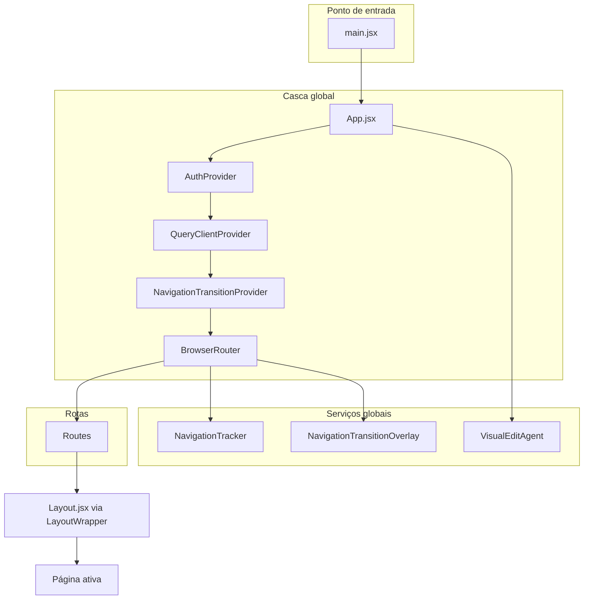
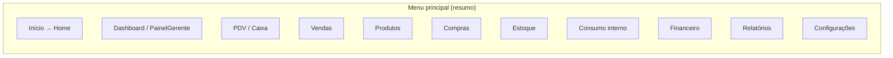
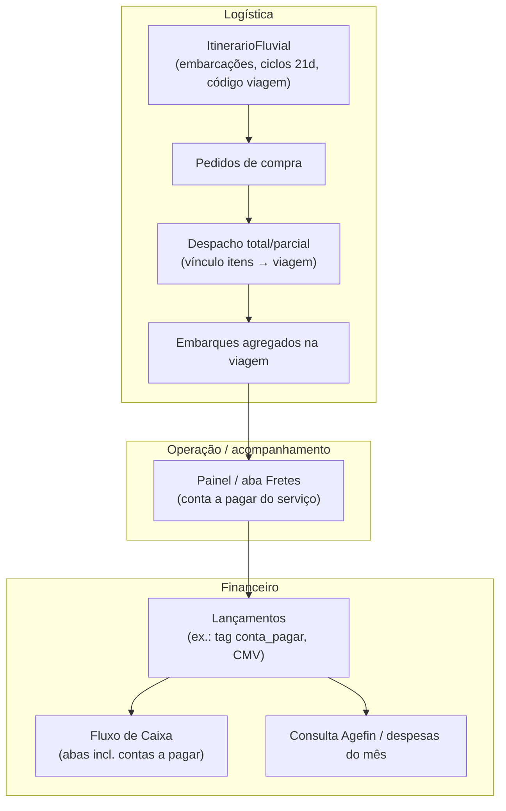
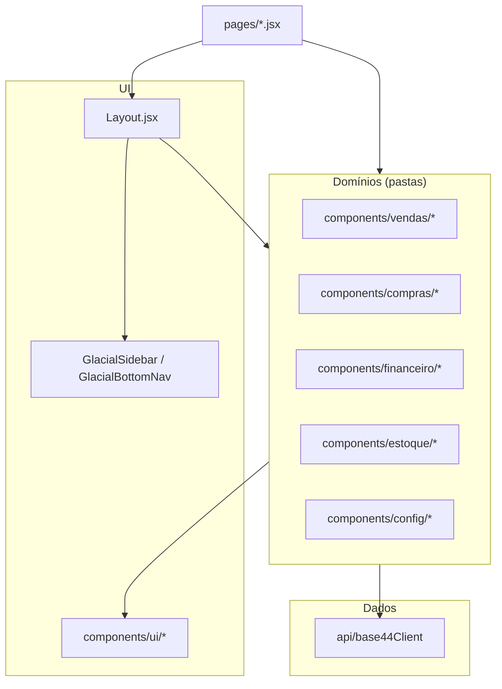

# Mapa de dependências e fluxos (varejosync)

Documento vivo para alinhar equipe e fornecer base para a fase de reciclagem de código.  
**Última extração:** a partir de `main.jsx`, `App.jsx`, `pages.config.js` e `components/config/usePermissoesResolvidas.jsx` (menu lateral).

---

## 1. Como o app sobe (cadeia técnica)

- **Autenticação:** `AuthContext` (via `AuthProvider`).
- **Dados remotos:** React Query (`query-client`).
- **Navegação:** transições + tracker; páginas costumam usar `base44` (`@/api/base44Client`).

---

## 2. Onde as rotas nascem (duas fontes)

Todas as URLs relevantes passam por `App.jsx`. Há **dois mecanismos**:

| Origem | Mecanismo | Padrão de URL |
|--------|-----------|----------------|
| **A** | `Object.entries(pagesConfig.Pages)` | `/{NomeDaChave}` — ex.: `/Dashboard`, `/FluxoCaixa` |
| **B** | `<Route>` explícitos no `App.jsx` | Mesmo padrão, mas a página **não precisa** estar só em `pages.config.js` |

Ou seja: uma tela pode estar **só** na lista explícita do `App.jsx` (com import direto) e ainda assim funcionar — desde que exista `<Route path="/...">`.

**Rotas especiais**

- `/` → `Home` (não usa o `mainPage` do config para essa rota; `mainPage` no `pages.config` hoje é `Dashboard`).
- `*` → `PageNotFound`.

**Lista de chaves em `pages.config.js` → `PAGES` (registro automático `/Chave`)**

`AnexoCompartilhado`, `Armazenagem`, `AuditoriaEstoque`, `AuditoriaEstoqueV2`, `AutoAtendimento`, `CaixasAtivos`, `Campanhas`, `Compras`, `ConferenciaEditor`, `ConferenciaEntrada`, `ConferenciaEstoque`, `ConferenciaItens`, `ConferenciaVolumes`, `Configuracoes`, `ControleCaixasAtivos`, `ControleEntregas`, `Dashboard`, `DashboardCaixa`, `DashboardVendedor`, `DevolucaoTroca`, `DiscriminarVolumes`, `EdicaoMassivaCustos`, `EditarProdutosEmMassa`, `EstimativaEmbalagensIA`, `Estoque`, `ExclusaoDocumentos`, `Expedicao`, `ExtratoConta`, `Financeiro`, `FinanceiroAprovacoes`, `FinanceiroModulo`, `FluxoCaixa`, `Home`, `HubLogistico`, `ImportacaoProdutos`, `InterfaceSeparador`, `Intervenientes`, `LogsAutenticacao`, `Manual`, `MapaFuncionalidades`, `Operacoes`, `OtimizacaoEstoqueIA`, `PDV`, `PDVAuditoria`, `PainelGerente`, `Produtos`, `ReimpressaoDocumentos`, `RelatorioMargem`, `RelatorioPerformance`, `Relatorios`, `TabelasPreco`, `Terceiros`, `TurnosFechados`, `Veiculos`, `Vendas`, `VendasGestao`, `VendasPerdidas`.

**Páginas com rota explícita no `App.jsx` (além do mapa acima, onde aplicável)**

Incluem entre outras: `Notificacoes`, `PDVCaixa`, `PDVVendedor`, `SugestoesCompra`, `Cotacoes`, `PedidosCompra`, `AprovacoesFinanceiras`, `TemplatesCompra`, `PedidoCompraDetalhe`, `TabelaPrecosConsulta`, `EditorLayoutsTres`, `DesignerDocumento`, `GestaoTemplates`, `LixeiraLancamentos`, `SimuladorCartao`, `ReversaoDespesasSangrias`, `ConsumoInterno`, `AuditoriaPins`, `AgefinConsulta`, `ItinerarioFluvial`, `AuditoriaCodigoProjeto` — garantem URL mesmo quando o fluxo de geração do `pages.config` não lista o ficheiro.

---

## 3. Menu lateral vs rotas (visão de negócio)

O menu é montado por `buildMenuItems` a partir de `ALL_MENU_ITEMS` em `usePermissoesResolvidas.jsx`. O campo `page` é passado a `createPageUrl` no `Layout` (navegação).

**Compras (submenu)** — ligação direta com logística fluvial:

- Sugestões → `SugestoesCompra`
- Cotações → `Cotacoes`
- Pedidos → `PedidosCompra`
- Conferência de entrada → `ConferenciaEntrada`
- **Boats** → `ItinerarioFluvial` (itinerário / embarcações / ciclos)

**Financeiro (submenu)**

- Fluxo de Caixa → `FluxoCaixa`
- Contas → `ContasFinanceiras`
- Aprovações → `AprovacoesFinanceiras`
- Caixas ativos → `CaixasAtivos`
- Turnos fechados → `TurnosFechados`
- Contas a pagar → `Agefin` (nome da página no menu; ver nota abaixo)

**Alinhamento menu ↔ rotas:** `ContasFinanceiras` e `Agefin` estão registadas em `pages.config.js` (`PAGES`), pelo que `/ContasFinanceiras` e `/Agefin` passam a existir como as demais chaves. A rota explícita `/AgefinConsulta` no `App.jsx` mantém-se em paralelo (URL alternativa).

---

## 4. Fluxo de negócio integrado (exemplo: logística fluvial → financeiro)

Visão **lógica** (não é grafo de imports de ficheiros; é o fluxo que descreveste para o negócio):

Ideia central: **uma mesma verdade de dados** (viagem, embarque, pedido, lançamento) aparece nas telas certas sem recriar o processo à mão.

---

## 5. Dependências de código (nível módulo)

- **Funções serverless** (regras no servidor) vivem em `base44/functions/`; não confundir com `src/functions/` (scripts espelhados — tema para reciclagem).

---

## 6. Fuso horário (Tabatinga, AM — UTC−5)

- **Local do negócio:** Tabatinga, Amazonas, Brasil. O identificador IANA oficial do fuso é **`America/Rio_Branco`** (UTC−5 o ano todo; sem horário de verão). O nome da cidade no IANA não é “Tabatinga”, mas o offset é o mesmo.
- Implementação: `src/components/utils/dateUtils.jsx` (`LOCAL_NEGOCIO`, `TIMEZONE_SISTEMA`, `dataHoje()`, `meioDiaSistemaISO()`, etc.).
- **Não usar** `new Date().toISOString().slice(0, 10)` nem `.split('T')[0]` para “hoje” ou comparar com `data_vencimento` só-data: isso é o **dia civil em UTC**, não em Tabatinga.
- Usar **`dataHoje()`**, **`inicioDiaSistemaISO` / `fimDiaSistemaISO`** para filtros na API, **`boundsMesCivil`** para limites de mês, **`meioDiaSistemaISO`** ao gravar só-data como instante, e **`formatarSoData`** para exibir vencimentos `YYYY-MM-DD`.

---

## 7. Próximos passos (fase reciclagem)

1. Continuar a cruzar **cada `page` do menu** com **rota real** (`App.jsx` + `PAGES`) para casos restantes.
2. Listar **ficheiros sem imports** (ferramenta tipo `knip` / ESLint no CI).
3. Decidir **fonte única** para `createPageUrl` e rotas duplicadas.
4. Migrar outros `toISOString`/filtros de data para `dateUtils` onde ainda restarem.
5. Manter este ficheiro atualizado quando entrarem páginas novas ou mudar o menu.

---

*João André / equipa: podem colar os blocos `mermaid` em Notion, GitHub ou [mermaid.live](https://mermaid.live) para exportar PNG/SVG.*
